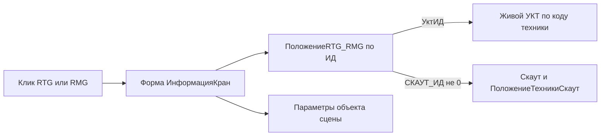

# Карточка RTG/RMG — отдельная форма

## Задача

По клику на кран `craneRtg` / `craneRmg` открывать отдельную форму `ИнформацияКран`. Сейчас в этом случае в поле «Карточка объекта» пишется текст ([`Форма/Module.bsl`](src/DataProcessors/d3_v4/Forms/Форма/Module.bsl), ветка в `ОбработатьВыборОбъекта`, строки 1086–1119).

У части кранов `СКАУТ_ИД = 0`. Форма ИнформацияТехника построена вокруг `СКАУТ_ИД`, поэтому у таких кранов она показала бы пустую карточку. У всех кранов в `yard-cranes-v4.json` есть `uktId`: это код `ПогрузочнаяТехника` в УКТ. По нему доступны все операционные данные. От `СКАУТ_ИД` зависит только телеметрия и водитель.

## Состав формы

| Группа | Поля | Источник | При отсутствии данных |
|---|---|---|---|
| Шапка | Наименование, тип RTG/RMG | параметры с объекта сцены | — |
| Размещение | Площадка, ось хода, текущая ячейка, дата положения | `siteId`, `movementAxis` из параметров; `Ячейка`, `ДатаОбновления` из `ПоложениеRTG_RMG` | ячейка из параметра `cellCode`, иначе «нет данных» |
| Задача | Статус задачи, дата статуса | живой УКТ `СтатусЗадачиНаТехнике` по `Техника.Код = УктИД`, последняя по `ДатаСтатуса` | «Нет задачи» |
| Контейнер | Номер, откуда, куда, операция, дата | живой УКТ `КонтейнерыНаТехникеВРаботе` по `ПогрузочнаяТехника.Код = УктИД` | 1) контейнер, откуда, куда из задачи `СтатусЗадачиНаТехнике`; 2) номер и ячейка из `ПоложениеRTG_RMG` (`Контейнер`, `Ячейка`, `ДатаСтатуса`) с пометкой «последнее известное» |
| Состояние Скаут | Скорость, двигатель, топливо, дата онлайн | API Скаут по `СКАУТ_ИД` | группа видима, текст «Нет трекера Скаут», поля скрыты |
| Водитель | Водитель, телефон | `ПоложениеТехникиСкаут` по `СКАУТ_ИД` | группа скрыта |

Если выключена `ПолучениеРеальныхДанных`, УКТ и Скаут не вызываются. Показываются данные сцены: ячейка и контейнер из индекса. Выводится сообщение «Реальные данные отключены», как в форме ИнформацияТехника.

## Реализация

1. **Запрос УКТ по коду** ([`ObjectModule.bsl`](src/DataProcessors/d3_v4/ObjectModule.bsl), `ПолучитьКонтейнерНаТехникеИзУКТ`). Выделить общую функцию, в которую передаются условие отбора и значение: `ПогрузочнаяТехника.СКАУТ_ИД` или `ПогрузочнаяТехника.Код`. Добавить экспортную `ПолучитьКонтейнерНаКранеИзУКТ(КодУКТ)`. Разбор результата и формирование «откуда/куда» остаются в одном месте. Сигнатуру существующей функции для ИнформацияТехника не менять.
2. **Статус задачи** (`ObjectModule.bsl`). Добавить экспортную `ПолучитьСтатусЗадачиКранаИзУКТ(КодУКТ)`. Она запрашивает `СтатусЗадачиНаТехнике` по `Техника.Код` с сортировкой `ДатаСтатуса УБЫВ` и берёт первую строку. Возвращает структуру: `Статус` (представление), `ДатаСтатуса`, `НомерКонтейнера`, `АдресОткуда`, `АдресКуда`. Выбор «откуда/куда» между наименованием и представлением должен идти через ту же вспомогательную функцию, что в п. 1, копировать его нельзя. Отбор по типу крана не нужен, код уже однозначно определяет технику. Запрос выполняется отдельным вызовом `ВыполнитьЗапросУКТ`; если он падает, группа «Контейнер» всё равно заполняется.
3. **Состояние Скаут и водитель.** Код из процедур `ЗаполнитьСостояниеИзСкаут` и `ЗаполнитьВодителяИзРегистра` формы ИнформацияТехника перенести в `ObjectModule` в виде функций. Функции возвращают структуру представлений: тексты, признак работы двигателя, водитель, телефон. Обе формы только выводят результат и раскрашивают поле двигателя. Так чтение Скаут не дублируется.
4. **Форма `ИнформацияКран`**, создаётся через EDT MCP (`create_metadata`), не правкой `.form`.
   - Параметры: `ИД`, `Наименование`, `ТипКрана`, `Площадка`, `ОсьХода`, `Контейнер`, `Ячейка`. Последние два берутся из индекса и нужны как запасной вариант.
   - `ПриСозданииНаСервере`: одним запросом прочитать строку `ПоложениеRTG_RMG` по `ИД` (`УктИД`, `СКАУТ_ИД`, `Контейнер`, `Ячейка`, `ДатаСтатуса`, `ДатаОбновления`). Затем заполнить группы по таблице выше: сначала статус задачи, потом контейнер. Задача нужна контейнеру как первый запасной источник. Ошибка УКТ или Скаут выводится сообщением и не мешает заполнить остальные группы.
   - Команда «Закрыть», режим `БлокироватьОкноВладельца`, ключ уникальности — `ИД` крана.
5. **Открытие** ([`Форма/Module.bsl`](src/DataProcessors/d3_v4/Forms/Форма/Module.bsl)).
   - Ветку `craneRtg` / `craneRmg` заменить вызовом новой клиентской процедуры `ОткрытьФормуИнформацииКрана(ОбъектСцены)`.
   - Код, который собирает текстовую карточку крана, удалить: те же данные показывает форма.
   - Поиск объекта проходит через `ОбработатьВыборОбъекта` и отдельной ветки не требует.
   - Портальный кран остаётся с текстовой карточкой.
   - Viewer, макеты, сборщик и `СобратьСекциюКранов` не меняются: `УктИД` и `СКАУТ_ИД` форма читает из регистра сама.

## Вне объёма

- Заполнение `СКАУТ_ИД` в УКТ и установка трекеров на краны.

## Проверка

- EDT MCP `get_project_errors` после BSL и метаданных.
- Ручная проверка в тонком клиенте (из этой среды недоступна):
  - кран с `СКАУТ_ИД ≠ 0`: все группы заполнены;
  - кран с `СКАУТ_ИД = 0`: статус задачи, контейнер, операция и ячейка есть, в блоке Скаут надпись «Нет трекера Скаут», водитель скрыт;
  - кран с задачей «Принята», но без записи в `КонтейнерыНаТехникеВРаботе`: контейнер и откуда/куда берутся из задачи;
  - простаивающий кран, по которому УКТ ничего не вернул: «Нет задачи», последний известный контейнер и ячейка из регистра;
  - кран без строки в `ПоложениеRTG_RMG`: данные из параметров сцены;
  - демо-режим;
  - открытие через поиск объекта;
  - портальный кран: по-прежнему текстовая карточка.
- Регресс формы ИнформацияТехника для техники Скаут после выноса общего кода.
