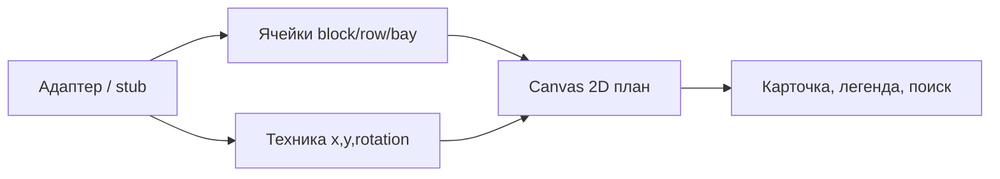

# Цифровой двойник терминала — плоский вид (d3_v3)

## Решение по веткам
- `d3` — старый демонстратор, не трогать.
- `d3_v2` — **заморожена**: эталон 3D/демо и контракт данных; дальнейших доработок нет.
- `d3_v3` — рабочая ветка: тот же домен и адаптер, **только вид сверху (2D)**.

## Нужен ли Three.js?

**Нет. Для чисто плоского вида сверху Three.js не нужен — рекомендую убрать.**

| Вариант | Плюсы | Минусы | Вердикт |
|--------|--------|--------|---------|
| **Canvas 2D (vanilla)** | Малый размер, предсказуем в WebKit 1С, простой pan/zoom и hit-test, нет WebGL/instancing | Сами пишем иконки техники и легенду | **Выбор для v3** |
| SVG | Удобный DOM-picking | 15k/3k элементов тяжёлы для встроенного браузера | Нет |
| Three.js + OrthographicCamera | Уже в проекте | 654 КБ, WebGL, лишняя 3D-модель; InstancedMesh в тонком клиенте уже ломался | Нет |
| Leaflet / PixiJS | Готовый pan/zoom или спрайты | Лишняя зависимость во встраиваемом HTML 1С | Позже, если понадобится |

**Почему Canvas:** операторский план — это сетка ячеек и десятки единиц техники, а не 15 000 отдельных 3D-боксов. Контейнеры на площадке агрегируются в ячейку `block/row/bay`; цвет = число ярусов (или занятость). Рисовать нужно порядка **числа слотов** (у текущего stub ~3 000 ячеек), а не 15 000 мешей.

Что **сохраняем** из v2 без Three:
- stub-адаптер и интерфейс `ПолучитьСнимок` / delta / карточка;
- topology блоков и `КоординатыСлота`;
- мост `#scene-command-bridge` / `#pick-bridge`;
- операторские команды (поиск, демо, spike).

## Целевая картина MVP v3

- Камера: вид сверху, pan (ЛКМ) + zoom (колесо), кнопка «Сброс».
- Площадки: контур блока + прямоугольники ячеек.
- Цвет ячейки: шкала по `count` / `maxTier` (пустая → бледная, полная → насыщенная); опционально подпись числа при крупном zoom.
- Техника: упрощённые фигуры/иконки (RTG, ричстакер, тягач, вагоны) в плане, без 3D-детализации.
- Клик: ячейка или единица техники → карточка (как в v2).
- Демо: движение тягача + «перекидывание» = изменение состава ячеек / позиции на плане.

## Модель данных (snapshot v3)

**В snapshot:**
- `site`, `topology.blocks` (атомарный слот = 20 ft: `bayPitch=6.25`, `bays=50`);
- `placements[]`: `{id, blockId, row, bay, tier, lengthFt, spanCells, cellIds}` — источник истины;
- объекты техники с `x,y,rotation,kind`.
- `cells[]` **не передаём**: сетка строится на клиенте из topology.

**Правила 20/40 ft:**
- 20 ft → 1 ячейка; 40 ft → `bay` + `bay+1` одной строки/яруса, один id, один двойной контур;
- опора: на `tier>1` каждый занятый слот должен иметь занятость на `tier-1` (для 40 ft — оба слота);
- цвет footprint = высота штабеля; размер 20/40 — формой контура.

Delta:
- `moves` техники;
- `placementUpserts` / `placementRemoved` для контейнеров;
- `cellUpserts` только для неструктурных метаданных (не для count).

Контракт осей: план `x,y` в метрах, Z в 2D не рисуется.

## Этапы работ

### 0. Заморозка и каркас v3
- Не менять `d3_v2`.
- В `d3_v3`: удалить `МакетThree`, убрать `@THREE` из HTML, вычистить 3D из `МакетJS`.
- Оставить CSS/HTML HUD, мосты, форму 1С.

### 1. Ячеистая модель
- Функция агрегации контейнеров → `cells`.
- Цветовая шкала 0…maxTier (легенда в HUD).
- Проверка: блоки A/B без пересечения (как в текущем stub после сдвига origin B).

### 2. Canvas viewer
- Один `<canvas>`, resize под viewport.
- Слои отрисовки: фон площадки → контуры блоков → ячейки → техника → выделение.
- Pan/zoom в метрах; hit-test ячейки через обратный slot resolver (или перебор слотов блока под курсором).
- Без WebGL.

### 3. Мост и delta
- `applyDelta`, `focus` (центрирование на id ячейки/техники), pick → 1С.
- Spike Δ100: менять `count` у 100 ячеек или сдвигать 100 единиц техники — с **видимым** эффектом.
- Критерий: пакет из 100 обновлений заметно быстрее, чем 4+ с в 3D-батчинге (ориентир &lt; 200–300 мс).

### 4. Операторский UI
- Карточка: для ячейки — block/row/bay, count, maxTier; для техники — kind, координаты.
- Поиск по id контейнера (если храним индекс id→ячейка) или по id техники / коду ячейки.
- Кнопка «Демо» как в v2, но в терминах плана.

### 5. Приёмка в тонком клиенте
- Старт до интерактивности ≤ 3 с на полном stub.
- Плавный pan/zoom на целевом клиенте.
- Picking ячейки и техники.
- Полнота размещения по ведомости ≥ 99,5 % (как в старом плане).

## Что сознательно не делаем в первом 2D-MVP
- Изометрия / «псевдо-3D».
- Анимация штабелирования.
- Gate, replay (суда и STS уже в демо).
- Three.js «на всякий случай».
- 40 ft вдоль оси `row` (только вдоль `bay`).

## Риски
- Слишком мелкая сетка на всём терминале → при zoom out не показывать подписи, только цвет; детали — при приближении.
- Старый WebKit и `devicePixelRatio` → рисовать с учётом DPR, как уже ограничивали framebuffer в 3D.
- Путаница d3 / v2 / v3 в ссылках плана — все новые ссылки только на `d3_v3`.
