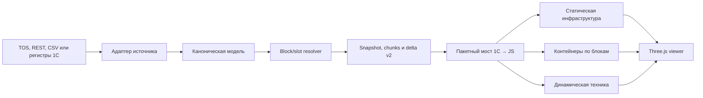

# Цифровой двойник контейнерного терминала

## Цель и границы
- Целевой объём: до 15 000 контейнеров и около 100 единиц техники в тонком клиенте 1С.
- Режим первой версии: только просмотр; изменения поступают из внешнего источника или тестового адаптера.
- Источник данных пока неизвестен, поэтому viewer не должен зависеть от формата конкретного TOS.
- Обработка `d3` заморожена в роли демонстратора и не изменяется. Вся дальнейшая работа по плану ведётся только в `d3_v2`, которая сейчас является её точной копией.
- Копию Three.js пока сохраняем в каждой обработке отдельно; вынос в общий макет не входит в объём плана.
- Первый MVP сразу использует полный набор из 15 000 контейнеров, береговую линию с причальной стенкой и разделением вода/суша, поиск, выбор и карточку объекта. Суда, STS-кран (Ship-to-Shore, причальный контейнерный перегружатель), gate, replay и расширенный quality overlay переносятся на последующие этапы.

## Целевая архитектура

## 0. Провести go/no-go spike
- В [Template.txt](C:/1c/d3/src/DataProcessors/d3_v2/Templates/МакетJS/Template.txt) на изолированной тестовой сцене проверить 15 000 контейнеров через `InstancedMesh`, picking по `instanceId` и изменение матриц без пересборки всей сцены.
- Проверить пакетное перемещение 100 единиц техники и определить реальный безопасный размер одной команды `scene-command-bridge`.
- Зафиксировать измерения на целевом тонком клиенте: время до интерактивности не более 10 секунд, FPS не ниже 20, применение пакета из 100 перемещений не более 500 мс.
- Если критерии не выполняются, до основной разработки выбрать упрощение: контейнеры-боксы без рёбер, меньшие чанки, загрузка только выбранных блоков или статические батчи с пересборкой одного блока.

## 1. Очистить демонстратор и собрать MVP
- В [Module.bsl](C:/1c/d3/src/DataProcessors/d3_v2/Forms/Форма/Module.bsl) удалить обработчик ожидания, автоматическое движение техники и перенос контейнеров по клику.
- Оставить клик только для выбора объекта и открытия read-only карточки.
- Первую сквозную версию проверять на тестовом CSV/JSON snapshot полного целевого объёма — 15 000 контейнеров.

## 2. Зафиксировать модель терминала и геометрию
- Ввести минимальные сущности MVP: `Terminal`, `YardBlock`, `Slot`, `Container`, `Equipment` и `DataQualityIssue`. `Berth`, `VesselVisit`, `Train` и `TruckVisit` добавить после MVP.
- Хранить контейнер через адрес `block/row/bay/tier`; resolver вычисляет `(x, y, z, rotation)` по origin блока, шагу рядов/бэев и ориентации.
- Получить layout блоков и минимум три контрольные точки для калибровки локальной метрической системы. Без этого этап считается заблокированным.
- Подготовить конфигурационный CSV/JSON layout: полигон суши, полигон воды, береговую линию, причальную стенку, границы площадки, блоки, дороги и ЖД. Пошаговая инструкция по векторизации растровой карты: [docs/qgis-vectorization.md](C:/1c/d3/docs/qgis-vectorization.md).
- Хранить береговую линию как метрическую полилинию, а сушу и воду — как отдельные полигоны. Это позволит отрисовывать реальную, в том числе непараллельную, конфигурацию причала без привязки к прямоугольной площадке.

## 3. Описать контракт и транспорт v2
- Зафиксировать JSON Schema и примеры для `snapshot`, `snapshotChunk`, `delta` и `ack`: [docs/scene-contract-v2.md](C:/1c/d3/docs/scene-contract-v2.md).
- Snapshot содержит `snapshotId`, `generatedAt`, локальную геопривязку, topology блоков и ожидаемое число чанков.
- Каждый chunk содержит `snapshotId`, `chunkIndex`, `blockId` и объекты; повторная передача безопасна.
- Delta содержит `baseSnapshotId`, монотонную `version`, `moves`, `upserts`, `removed` и `quality`. Пропуск версии вызывает запрос полного resync.
- `data-payload` использовать только в пределах измеренного spike лимита. Snapshot передавать серией подтверждаемых чанков; при неудовлетворительной скорости предусмотреть временный файл или локальный HTTP URL.
- Не хранить полный snapshot в реквизите `ДанныеСценыJSON`; форма хранит только идентификатор snapshot, текущую версию, прогресс и данные выбранного объекта.

## 4. Разделить слои рендера под 15 000 контейнеров
- Статическую инфраструктуру собирать один раз отдельными батчами: полигон суши, водную поверхность, причальную стенку, дороги, ЖД и контуры блоков.
- Причальную стенку выделить отдельной геометрией с небольшой высотой над водой; вода и суша получают визуально различимые материалы, но без тяжёлых отражений и анимации в MVP.
- Контейнеры группировать по `blockId` и ISO-типу в отдельные `InstancedMesh`. Это даёт culling целого блока и ограничивает локальную перестройку.
- Для каждого блока вести `id → instanceIndex`, обратный индекс, free-list и ёмкость с резервом. Удаление освобождает slot, добавление переиспользует его; компактная перестройка выполняется только при необходимости.
- Технику до 100 объектов хранить как отдельные `Object3D`/группы и обновлять только transform.
- Убрать постоянные рёбра контейнеров; контур рисовать только для выбранного объекта. Для picking контейнеров использовать `instanceId`, для техники — `userData.id`.
- Расширить runtime API операциями `loadSnapshotChunk`, `completeSnapshot`, `applyDelta`, `setLayerVisibility` и `focusObject`.

## 5. Отделить данные от формы 1С
- Вынести demo-генератор и подготовку DTO из формы в [ObjectModule.bsl](C:/1c/d3/src/DataProcessors/d3_v2/ObjectModule.bsl) и [ManagerModule.bsl](C:/1c/d3/src/DataProcessors/d3_v2/ManagerModule.bsl).
- Определить интерфейс адаптера: `ПолучитьСнимок()`, `ПолучитьЧанкСнимка(snapshotId, chunkIndex)`, `ПолучитьИзменения(ПослеВерсии)`, `ПолучитьКарточкуОбъекта(id)` и `ПолучитьСостояниеОбмена()`.
- До появления TOS использовать CSV/JSON stub-адаптер с тем же интерфейсом.
- Нормализовать дубли ID, неизвестные location code, конфликт слотов и устаревшие координаты до передачи в viewer.
- Начальные интервалы polling: 5 секунд для техники и 30–60 секунд для контейнеров; все изменения одного цикла отправлять одной delta.

## 6. Реализовать минимальный операторский интерфейс
- По клику показывать номер, тип, блок/слот, статус и время последнего наблюдения.
- Добавить поиск контейнера или техники с фокусировкой камеры.
- Добавить базовые фильтры по блоку, типу объекта и свежести данных, легенду и индикатор состояния обмена.
- Пресеты камеры и расширенный quality overlay выполнять после стабильной работы MVP.

## 7. Проверка и поэтапный ввод
- Откалибровать береговую линию, причальную стенку и блоки по контрольным точкам; сверить slot resolver с оперативной ведомостью.
- Проверить snapshot сразу на 15 000 контейнеров: время открытия, память, FPS, picking и поиск.
- Проверить добавление, удаление и перестановку контейнеров внутри блока, заполнение free-list и resync после пропуска версии.
- Проверить пакетные delta для 100 единиц техники без полной пересборки контейнерного слоя.
- Критерии приёмки: FPS не ниже 20, старт до интерактивности не более 10 секунд, delta из 100 перемещений до 500 мс, полнота размещения не ниже 99,5%, неизвестные адреса отражены в диагностике.
- После успешной проверки полного объёма 15 000 контейнеров последовательно подключать дополнительную инфраструктуру и интеграцию с реальным TOS.
