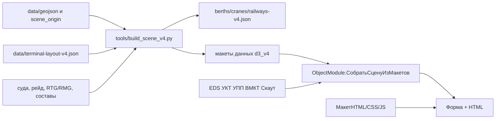

# [AGENTS.md](http://AGENTS.md)

Рабочий контракт для агентов в репозитории цифрового двойника контейнерного терминала.

Конфигурация 1С EDT `d3`, совместимость 8.3.27, язык модулей русский, управляемые формы, `modalityUseMode = DontUse`. Viewer — vanilla Canvas 2D в HTML-поле тонкого клиента. Целевой объём — тысячи ячеек, техника, суда и вагоны; не рисуйте 15 000 отдельных контейнеров.

## Версии

Активная работа только в `Обработка.d3_v4`.

`d3`, `d3_v2`, `d3_v3` заморожены. Стартовая форма (`src/CommonForms/Стартовая`) открывает все версии. Не меняйте архив без явной просьбы.

Не запускайте `tools/build_topology_from_geojson.py` для задач V4 — это сборщик V3.


## Куда менять




| Задача                               | Куда                                                                                                                                         |
| ------------------------------------ | -------------------------------------------------------------------------------------------------------------------------------------------- |
| Геометрия QGIS, CRS, `scene_origin`  | исходники в `data/`, затем сборщик                                                                                                           |
| Логическая топология площадок        | `data/terminal-layout-v4.json`                                                                                                               |
| Демо суда, рейд, RTG/RMG, составы    | `data/vessels-v4.json`, `data/anchorage-vessels.json`, `data/yard-cranes-v4.json`, `data/trains-v4.json`                                     |
| Сборка сцены, TOS-адаптеры, fallback | `src/DataProcessors/d3_v4/ObjectModule.bsl`                                                                                                  |
| WS-клиенты EDS/УПП/УКТ/ВМКТ          | `src/DataProcessors/d3_v4/ManagerModule.bsl`                                                                                                 |
| UI формы, карточки, мосты            | `src/DataProcessors/d3_v4/Forms/Форма/Module.bsl`, форма `ИнформацияЯчейка`                                                                  |
| Отрисовка Canvas 2D                  | макеты `МакетHTML`, `МакетCSS`, `МакетJS`                                                                                                    |
| Метаданные 1С                        | EDT MCP (`write_module_source`, `get_project_errors`); не сырой `.mdo`, если MCP доступен                                                    |
| GPS техники Скаут                    | `DataProcessor.Скаут`, регистр `ПоложениеТехникиСкаут`, регламент `ПолучитьТехникуСкаут` → `ОбновлениеТехникиСкаут.ОбновитьПоложениеТехники` |
| Снимки EDS/УПП/УКТ                   | регистр `СнимкиОнлайнДанныхТерминала`, модуль `ОбновлениеОнлайнДанныхТерминала`, задания `ПолучитьСудаEDS` / `ПолучитьВагоныУПП` / `ПолучитьНаполнениеПлощадокУКТ` |


Поля судов, кранов, вагонов и правила QGIS не дублируйте здесь: `docs/terminal-layout-v4.md`, `docs/qgis-vectorization.md`, примеры в `docs/`.

## Исходники и производные

Править исходники, затем собрать. Не править производные руками.

**Правила разработки**

Для изменения метаданных использовать EDT-MCP, а не править xml.
Для соблюдения стандартов разработки используй v8std MCP.
Писать код по SOLID, DRY и KISS:

- **S**ingle Responsibility — один модуль/процедура/функция решает одну задачу.
- **O**pen/Closed — расширять поведение без ломки существующего кода (новые ветки, адаптеры, параметры), а не правкой всех вызовов.
- **L**iskov Substitution — подмена реализации (демо/live, источник данных) не ломает контракт вызывающего.
- **I**nterface Segregation — не тащить лишние параметры и поля «на всякий случай»; контракт ровно под задачу.
- **D**ependency Inversion — зависеть от абстракции (макет/адаптер/команда viewer), а не от конкретной системы EDS/УКТ/УПП.
- **DRY** — не копировать логику; общее вынести в одну процедуру. Дубли констант, маппингов и разбора JSON — ошибка.
- **KISS** — самое простое решение, которое работает; без лишних слоёв, флагов и обобщений «на будущее».


**Исходники**

- `data/terminal-layout-v4.json`
- `data/scene_origin.txt`
- GeoJSON в `data/geojson/`: площадки и оси бэев, берег, вода, здания, дороги, граница порта, причалы, портальные краны, визуальные рельсы, ветки размещения, рейд
- ручные реестры: `vessels-v4.json`, `anchorage-vessels.json`, `yard-cranes-v4.json`, `trains-v4.json`

Не используйте `data/geojson/not_use/`, `data/berth.geojson` в корне `data/` и прочие leftover V3.

**Производные — не править**

- `data/berths-v4.json`, `data/cranes-v4.json`, `data/railways-v4.json`
- макеты данных `d3_v4`: `*V4_json`, `*_geojson`, `SceneOrigin_txt`, `SceneManifestV4_json`

Сборщик синхронизирует макеты данных и не меняет BSL, V3 и макеты `МакетHTML` / `МакетCSS` / `МакетJS`.

## Живые источники

Константа `ПолучениеРеальныхДанных` переключает runtime. Сбой одного источника не отменяет остальные. JSON-макеты — только демонстрационный режим. В реальном режиме EDS, УПП и УКТ не вызываются при открытии формы: сцена читает последний совместимый снимок из `СнимкиОнлайнДанныхТерминала`.


| Источник | Описание                                                                                                         | Что даёт                                                                                                                                                                                           |
| -------- | ---------------------------------------------------------------------------------------------------------------- | -------------------------------------------------------------------------------------------------------------------------------------------------------------------------------------------------- |
| EDS      | Единая Диспетчерская СлужбаКонфигурация 1С на основе Управление Торговлей 11.5                                  | суда у причалов и на рейде; регламент `ПолучитьСудаEDS` пишет одну строку `EDS / Vessels`                                                                                                                                 |
| УКТ      | Управление Контейнерным ТерминаломСамописная конфигурация 1С                                                    | наполнение площадок и справочник ячеек; регламент `ПолучитьНаполнениеПлощадокУКТ` пишет `УКТ / Placements` и `УКТ / Cells` атомарно                                                                                         |
| ВМКТ     | Владивостокский Морской Контейнерный ТерминалКонфигурация 1С на основе 1С Бухгалтерия Предприятия 3.0           | доп. сведения по контейнеру в карточке ячейки; живой WS, не снимок                                                                                                                                                          |
| УПП      | Управление производственным ПредприятиемКонфигурация 1С на основе 1С УПП 1.1                                    | вагоны; регламент `ПолучитьВагоныУПП` пишет одну строку `УПП / Wagons`                                                                                                                                                      |
| Скаут    | Система мониторинга транспорта.Описание API: [https://apidocs.scout-gps.ru/#/](https://apidocs.scout-gps.ru/#/) | GPS по-прежнему в `ПоложениеТехникиСкаут` (регламент раз в 20 с, хранение 1 ч). Форма читает этот регистр тем же 20-секундным polling, что и снимки EDS/УПП/УКТ. При выключенном флаге — демотехника из `ObjectModule` |


Для EDS, УПП и УКТ хранится только последний успешный снимок, без срока давности и без истории. Ошибка получения или преобразования не удаляет прежний снимок. Несовместимый по `BuildId` снимок физически сохраняется, но сцене не показывается. Пустой успешный ответ — актуальное пустое состояние слоя. Расписания трёх заданий задаёт администратор в ИБ (рекомендуется 120 с и смещения стартов 0/40/80 с для УКТ/EDS/УПП). Карточка ячейки и ВМКТ по-прежнему обращаются к живым WS.

Не коммитьте пароли и URL из справочника `ИнформационныеБазыПорта` и константы `ТокенСкаут`.

## Инварианты

- CRS слоёв V4: `EPSG:32652`. Начало сцены — `data/scene_origin.txt`.
- Адрес ячейки: `siteId + zoneId + zoneBay + row`. Bay локален зоне, Row общий для площадки.
- Имена свойств JSON, которые 1С читает в `Структура`, не могут содержать точку или пробел. Код `фит.пл.` — только значение `type`. `wagonTypes` — массив, не объект.
- Визуальные рельсы только из `railways_visual_v4`. `railway_branches_v4` — невидимая направляющая вагонов.
- Viewer: Canvas 2D без CDN, Three.js и внешних библиотек. Мосты `#pick-bridge` и `#scene-command-bridge`.
- Сцена V4 в реальном режиме собирается из макетов плюс совместимых снимков EDS/УПП/УКТ. Форма раз в 20 с одним серверным вызовом читает снимки и регистр Скаут; команды viewer `updateVessels` / `updateRailWagons` / `updatePlacements` / `updateScoutVehicles`. Запись снимков EDS/УПП/УКТ — отдельные регламенты; запись Скаут — `ПолучитьТехникуСкаут`.
- Константа `ОтрисовкаПутейДляВагонов` — runtime-команда `setDrawRailwayBranches`, не пересборка макетов.
- BSL: не смешивайте клиент и сервер, не используйте модальные и синхронные вызовы платформы.


## Команды и проверка

После правок исходников:

```powershell
python tools/build_scene_v4.py --check
python tools/build_scene_v4.py
```

`--check` ничего не пишет. Обычный запуск обновляет производные JSON и макеты данных; при ошибке исходники и макеты не меняются.

После BSL и метаданных: EDT MCP `get_project_errors`. После JS — откройте форму V4 в тонком клиенте; автотестов viewer нет.

Дополнительно: `docs/terminal-layout-v4.md`, `docs/qgis-vectorization.md`, `tools/README.md`.